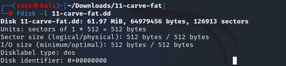

# Lab 03 — File Carving from a Corrupted Drive Image

**Source:** CompTIA Security+ CertMaster Labs — Performing Digital Forensics (Section 12.1.11)
**Environment:** KALI Linux — forensic test image `11-carve-fat.dd`
**Tools:** mount, fdisk, fiwalk, fsstat, mmls, testdisk (file carving mode)
**Technique:** Digital forensics — file carving from corrupted/damaged drive image
**Security+ Objectives:** 4.8 / 4.9
**Status:** ✅ Complete

---

## Scenario

The IRT was informed that a second drive image was available from the suspect's system — one where data destruction was suspected. Unlike the previous exercise where the file system metadata was intact, this drive image showed signs of corruption. The task was to attempt data recovery through **file carving** — a technique that recovers files based on their content signatures rather than file system metadata.

---

## Environment

| System | Role |
|--------|------|
| KALI | Forensic analysis workstation |
| 11-carve-fat.dd | Corrupted FAT16 forensic test image |

---

## Background: File Carving

File carving is the process of recovering files from a drive image when the file system metadata is unavailable, corrupted, or deliberately destroyed. Instead of relying on directory entries or inodes, carving tools search the raw byte stream for known file signatures (magic bytes) — the fixed byte sequences that mark the start and end of specific file types (e.g., `FF D8 FF` for JPEG, `25 50 44 46` for PDF).

File carving is a last resort — it works even when:
- The partition table is destroyed
- The file system is corrupted
- Files have been deleted and metadata overwritten

However, it cannot recover file names, timestamps, or directory structure — only raw file content.

---

## Setup

Extracted the test image:

```bash
cd /root/Downloads
unzip 11-carve-fat.zip
cd 11-carve-fat
ls -4
```

Target file: `11-carve-fat.dd`

---

## Part 1 — Attempt Standard Analysis (Confirm Corruption)

### Step 1 — Mount Attempt

```bash
mount 11-carve-fat.dd /mnt/temp11
```

Result: **Mounting error** — something is corrupted in the image. Cannot be mounted directly.

### Step 2 — fdisk

```bash
fdisk -l 11-carve-fat.dd
```

Result: **Partial output** — the Disk identifier value was all zeros, and no partition table was displayed. Confirms the drive image is damaged at the partition table level.


### Step 3 — fiwalk

```bash
fiwalk 11-carve-fat.dd
```

Result: **Multiple errors** — most stating *"Possible encryption detected."* This is fiwalk's response when it cannot interpret a file system structure — the data appears random/garbled, which can be caused by encryption, corruption, or deliberate destruction.

### Step 4 — fsstat

```bash
fsstat 11-carve-fat.dd
```

Result: **Possible encryption detected.** Cannot determine file system type.

```bash
fsstat -f fat16 11-carve-fat.dd
```

Result: **Invalid magic value** — the partition table header is corrupted and cannot be interpreted.

### Step 5 — mmls

```bash
mmls 11-carve-fat.dd
```

Result: **No results** — partition offsets cannot be determined. This means `fsstat`, `fls`, and `istat` with sector offsets are also not available.

**Conclusion:** Standard forensic analysis is not possible on this image. File carving is the only remaining recovery option.

---

## Part 2 — File Carving with testdisk

`testdisk` includes a file carving capability that can operate even when the partition table and file system are unreadable.

```bash
mkdir output
testdisk 11-carve-fat.dd
```

In the testdisk interactive interface:

1. Selected **Proceed**
2. Selected partition table type: **None** (no valid partition table)
3. An **Unknown** partition was presented
4. Changed partition type to **FAT16**
5. At the partition display, selected **Undelete** using the right arrow key
6. Typed `a` to select all files
7. Typed `C` (uppercase) to copy the selected files to the output directory

> Warning: lowercase `c` copies only a single file. Must use uppercase `C` to copy all.

Selected the `output` subdirectory as the destination. Result: **Copy done! 15 OK, 0 failed**

Pressed `q` to exit Undelete, then `Boot` → **Rebuild BS** to attempt to rebuild the boot sector (the likely cause of the read/access problem).

Result: *"Extrapolated boot sector and current boot sector are different."* — testdisk confirmed the boot sector was corrupted and attempted an in-memory repair to enable recovery.

---

## Part 3 — Inspect Recovered Files

```bash
cd output
ls -4
```

**15 files recovered.**

```bash
xdg-open haxor2.jpg
```

Cycled through the recovered graphics files using arrow keys. Opened `lin_1.2.pdf` to view the recovered PDF.

**Scored question:**

Which recovered image file includes cats?

> Answered correctly: **pumpkin.jpg**

---

## Recovered File Summary

| Metric | Value |
|--------|-------|
| Files visible via standard mount | 0 (mount failed) |
| Files visible via fdisk/fsstat | 0 (partition table corrupted) |
| Files recovered by testdisk file carving | **15** |

The recovered files included `.jpg` images, a `.pdf`, a `.mov` video, and a `.zip` archive — a variety of file types identifiable by their magic bytes despite the destroyed file system metadata.

---

## Forensic Tool Progression Summary

For corrupted or damaged drive images, the analysis sequence is:

```
mount → FAIL
fdisk → FAIL (zeros in disk identifier)
fiwalk → FAIL (encryption/corruption errors)
fsstat → FAIL (invalid magic value)
mmls → FAIL (no partition layout)
testdisk file carving → SUCCESS (15 files recovered)
```

> The lesson from this progression: **persistence and tool diversity are essential.** A single tool failure does not mean evidence is unrecoverable.

---

## Key Takeaway

File carving demonstrates that destroying a file system does not necessarily destroy the underlying data. Corrupting the partition table and boot sector — as happened in this image — renders standard tools useless but leaves the raw file content intact in the data sectors. testdisk recovered 15 files by searching for file content signatures directly, bypassing the destroyed metadata entirely. For defenders, this reinforces that **secure data destruction requires overwriting data sectors**, not just corrupting the file system structures that reference them.

---

*Write-up by Lereko Mohlomi | [LinkedIn](https://www.linkedin.com/in/lereko-mohlomi/) | [Back to Digital Forensics](./README.md)*
