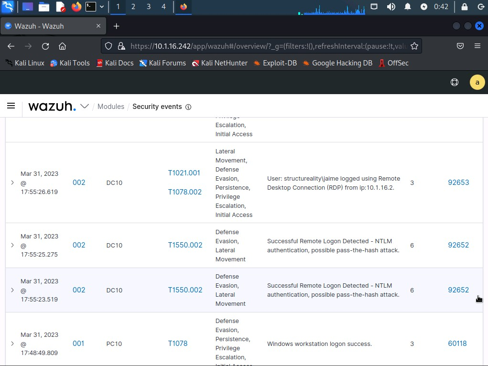

# Lab 01 — Detecting Logon Events with Wazuh

**Source:** CompTIA Security+ CertMaster Labs — Incident Response: Detection (Section 12.1.11)
**Environment:** KALI → WAZUH (Ubuntu Server) → DC10 (Windows Server 2019) → PC10 (Windows Server 2019 client)
**Tool:** Wazuh SIEM/XDR platform
**Techniques:** Dictionary-based password guessing (Hydra), SMB share mounting, IoC detection via SIEM
**MITRE ATT&CK:** T1110 — Brute Force / T1021.002 — SMB/Windows Admin Shares
**Security+ Objectives:** 2.4 / 3.2 / 4.4 / 4.5 / 4.8 / 4.9
**Status:** ✅ Complete

---

## Scenario

As a security professional at Structureality Inc., the objective was to use the wazuh automated security platform to detect IoCs related to suspicious logon activity against a domain controller (DC10). The lab demonstrates the **detection phase** of an Incident Response Plan — specifically, how SIEM automation enables continuous monitoring of logon events that would be impractical to detect manually at scale.

---

## Environment

| System | Role | IP |
|--------|------|----|
| KALI | Security workstation / attacker simulation | 10.1.16.66 |
| WAZUH | SIEM platform (Ubuntu Server) | 10.1.16.242 |
| DC10 | Domain controller — attack target (Windows Server 2019) | 10.1.16.1 |
| PC10 | Domain workstation (Windows Server 2019 client) | — |

---

## What is Wazuh?

Wazuh is an open-source security platform built on OSSEC that provides log analysis, file integrity monitoring, vulnerability detection, intrusion detection, configuration assessment, and incident response. In this environment it functions simultaneously as a **SIEM**, **IDS**, and **SOAR** platform. The wazuh agent installed on monitored systems (DC10, PC10) forwards event log data to the wazuh server, where rules are applied to classify and alert on suspicious activity.

**Wazuh alert level scale (0–16):**

| Range | Severity |
|-------|----------|
| 0–3 | Informational |
| 4–7 | Low |
| 8–11 | Medium |
| 12–15 | High |
| 16 | Emergency |

---

## Part 1 — Prepare the Attack Environment

### Step 1 — Create a Custom Password List

From the KALI terminal, added the lab password `Pa$$w0rd` to the 57th line of the rockyou-derived wordlist:

```bash
# Created /root/passlist.txt containing Pa$$w0rd at line 57
# Based on /usr/share/seclists/Passwords/500-worst-passwords.txt
```

This simulates an attacker who has gathered intelligence about likely passwords in the target environment before launching a dictionary attack.

### Step 2 — Access the Wazuh Dashboard

Accessed the wazuh web interface at `https://10.1.16.242` and signed in as **admin**. Navigated to **Security events** and filtered to the **DC10 (001)** agent to focus monitoring on the domain controller.

Confirmed the timer interval was set to *Last 24 hours* — sufficient scope for this exercise.

---

## Part 2 — Simulate Attack 1: Dictionary-Based Password Guessing

From the KALI terminal, ran a Hydra dictionary attack against the RDP service on DC10:

```bash
hydra -t 1 -V -f -l administrator -P passlist.txt rdp://10.1.16.1
```

**Command breakdown:**

| Flag | Meaning |
|------|---------|
| `-t 1` | Single thread |
| `-V` | Verbose — show each attempt |
| `-f` | Stop after first successful guess |
| `-l administrator` | Target the administrator account |
| `-P passlist.txt` | Use the custom password list |
| `rdp://10.1.16.1` | Target protocol and host |

**Result:** 57 attempts made. The 57th attempt succeeded — `Pa$$w0rd` confirmed as the administrator password.

---

## Part 3 — Review Wazuh Alerts: Password Guessing Detection

Refreshed the wazuh Security events page and searched for **Rule ID 92652**.

**Alert observed:**

| Field | Value |
|-------|-------|
| Rule ID | 92652 |
| Description | Successful password discovery |
| Technique | Pass the Hash (T1550.002) |

> **Important caveat:** The wazuh rule mapped this event to **Pass the Hash (T1550.002)**, but that is not what was performed. Pass the Hash requires stealing an NTLM hash from memory and using it directly — the technique used here was a **dictionary brute-force**. This illustrates a key limitation of SIEM default rules: **the Techniques/Tactics columns reflect rule-based pattern matching, not confirmed ground truth.** Always validate alerts against raw log data before concluding on technique.

**Wazuh Security Alert columns:**
- **Techniques** — MITRE ATT&CK technique reference code (clickable — links to detail page)
- **Tactics** — Higher-level category grouping related techniques
- **Description** — Rule-defined description of the event type
- **Level** — Severity (0–16)

**Wazuh rule components:**
- Rule ID, Description, Level, Groups, Frequency, Timeframe, Match, Decoders, Options, MITRE ATT&CK ID

---

## Part 4 — Simulate Attack 2: SMB Admin Share Mount

From the KALI terminal, attempted to mount the Windows administrative C$ share on DC10.

**Attempt 1 — with jaime credentials (expected to fail):**

```bash
mkdir /mnt/dc10-c
mount -o username=jaime //10.1.16.1/c$ /mnt/dc10-c
# Password: Pa$$w0rd
```

Result: **Mount failed** — the jaime account does not have the privileges required to access administrative shares.

**Attempt 2 — with administrator credentials (expected to succeed):**

```bash
mount -o username=administrator //10.1.16.1/c$ /mnt/dc10-c
# Password: Pa$$w0rd
```

Result: **Mount succeeded** — full access to the C$ administrative share on DC10.

---

## Part 5 — Review Wazuh Alerts: Logon Event Detection

Returned to the wazuh Security events page and located alerts for the mount attempts.

| Rule ID | Event | Description |
|---------|-------|-------------|
| 60122 | Logon failure — jaime | Logon failure — Unknown user or bad password |
| 60106 | Logon success — administrator | Successful logon |

**MITRE Technique codes for logon failure (Rule ID 60122):**
- **T1078** — Valid Accounts
- **T1531** — Account Access Removal

> Scored question answered correctly: T1078 and T1531

---

## Attack Summary

| Step | Action | Wazuh Detection |
|------|--------|----------------|
| Hydra dictionary attack (57 attempts) | Password guessing against RDP | Rule 92652 — Successful password discovery |
| SMB mount with jaime / Pa$$w0rd | Logon failure — insufficient privileges | Rule 60122 — Logon failure |
| SMB mount with administrator / Pa$$w0rd | Logon success — C$ share mounted | Rule 60106 — Logon success |


---

## Key Takeaway

The detection phase of incident response depends entirely on the quality of log collection and rule configuration. In this lab, wazuh detected both the brute-force outcome and the subsequent lateral movement attempt from a single platform — without any manual log review. However, the Pass the Hash misclassification demonstrates that **SIEM alerts are hypotheses, not verdicts**. Every alert must be validated against raw event data before escalating or responding.

---

*Write-up by Lereko Mohlomi | [LinkedIn](https://www.linkedin.com/in/lereko-mohlomi/) | [Back to Incident Response](./README.md)*
