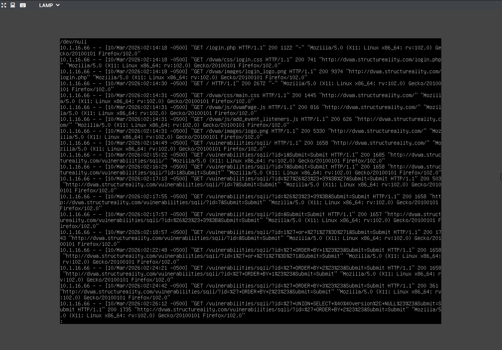

# Lab 02 — Investigating SQLi via Log Analysis

**Source:** CompTIA Security+ CertMaster Labs (Section 8.2.6 — Exploiting and Detecting SQLi)
**Environment:** LAMP VM (Ubuntu Server) — Apache access logs
**Technique:** Log Analysis, IoC Identification, Percent-Encoding Decoding
**Security+ Objectives:** 4.9 Given a scenario, use data sources to support an investigation
**Status:** ✅ Complete

---

## Scenario

Following reports of compromised user accounts and a potential data dump on a hacker forum, a suspicion arose that the company website had been targeted by a SQLi attack. Working from the LAMP server hosting the website, the task was to analyse the Apache access log to find evidence and IoCs of SQLi activity.

---

## Environment

- **Investigator machine:** LAMP VM (Ubuntu Server)
- **Log location:** `/var/log/apache2/access.log`
- **Log format:** Apache Combined Log Format

---

## Apache Combined Log Format

The Apache access log records the following fields per entry:

| Field | Description |
|-------|-------------|
| 1 | IP address of the client |
| 2 | Identity of the client (usually `-`) |
| 3 | User ID (usually `-` if no authenticated session) |
| 4 | Date and time of the request |
| 5 | HTTP request type, resource, and protocol |
| 6 | HTTP response status code |
| 7 | Size of the returned object |
| 8 | HTTP referrer (page that linked to this request) |
| 9 | User Agent string |

---

## Methodology

### Step 1 — Accessing the Logs

Connected to the LAMP VM, elevated to root, and navigated to the Apache log directory:

```bash
sudo su
cd /var/log/apache2
ls -l
less access.log
```


---

### Step 2 — Identifying Initial Reconnaissance

Located the first SQLi-related entry in the log — a benign-looking initial probe:

```
"GET /vulnerabilities/sqli/?id=1&Submit=Submit## HTTP/1.1"
```

**On its own this looks benign** — a normal user ID lookup. However the HTTP referrer for this entry pointed to `/vulnerabilities/sqli` — the SQLi page itself, indicating the user navigated directly to the vulnerable page. This is an early reconnaissance indicator.

The next entry showed a submission of `7` — another probe to enumerate valid user IDs.

---

### Step 3 — Identifying the Metacharacter Test (IoC #1)

The log showed submission of a single quote — percent-encoded in the HTTP request:

```
"GET /vulnerabilities/sqli/?id=%27&Submit=Submit## HTTP/1.1"
```

**Decoded:** `%27` = `'` (single quote)

This is the standard SQLi metacharacter test. Its presence in a log is a clear IoC of SQLi reconnaissance.

---

### Step 4 — Identifying the Boolean Injection (IoC #2)

The Boolean tautology injection appeared in the log as:

```
"GET /vulnerabilities/sqli/?id=1%27+or+%271%27%3D%271&Submit=Submit## HTTP/1.1"
```

**Decoded:**
- `%27` = `'`
- `+` = space
- `%3D` = `=`

**Full decoded injection:** `1' or '1'='1`

This is the first definitive IoC of a SQLi attack — a logical operation designed to return all database records.

---

### Step 5 — Identifying Schema Enumeration (IoC #3, #4, #5)

**Column count enumeration:**
```
"GET /vulnerabilities/sqli/?id=%27+ORDER+BY+1%23&Submit=Submit## HTTP/1.1"
```
Decoded: `' ORDER BY 1#` — attacker determining column count.

**DBMS version fingerprinting:**
```
"GET /vulnerabilities/sqli/?id=%27+UNION+SELECT+@@version%2CNULL%23&Submit=Submit## HTTP/1.1"
```
Decoded: `' UNION SELECT @@version, NULL#` — absolute evidence of UNION-based SQLi and DBMS reconnaissance.

**Table name extraction:**
```
"GET /vulnerabilities/sqli/?id=%27+UNION+SELECT+table_schema%2Ctable_name+FROM+information_schema.tables%23&Submit=Submit## HTTP/1.1"
```
Decoded: `' UNION SELECT table_schema, table_name FROM information_schema.tables#` — schema enumeration in progress.

**Column name extraction:**
```
"GET /vulnerabilities/sqli/?id=%27+UNION+SELECT+table_name%2Ccolumn_name+FROM+information_schema.columns%23&Submit=Submit## HTTP/1.1"
```
Decoded: Column enumeration across all tables — directly precedes credential extraction.

**Credential extraction:**
```
"GET /vulnerabilities/sqli/?id=%27+UNION+SELECT+user%2Cpassword+FROM+users%23&Submit=Submit## HTTP/1.1"
```
Decoded: `' UNION SELECT user, password FROM users#` — **direct evidence of credential exfiltration.**

---

## IoC Summary

| Log Entry | Decoded Injection | IoC Significance |
|-----------|------------------|-----------------|
| `%27` | `'` | Metacharacter test — SQLi reconnaissance |
| `1%27+or+%271%27%3D%271` | `1' or '1'='1` | Boolean tautology — all records returned |
| `%27+ORDER+BY+1%23` | `' ORDER BY 1#` | Column count enumeration |
| `%27+UNION+SELECT+@@version%2CNULL%23` | `' UNION SELECT @@version, NULL#` | DBMS fingerprinting |
| `%27+UNION+SELECT+table_schema...` | UNION + information_schema query | Schema enumeration |
| `%27+UNION+SELECT+user%2Cpassword+FROM+users%23` | `' UNION SELECT user, password FROM users#` | Credential exfiltration |

---

## Key SQL Expressions Used as IoC Identifiers

| SQL Expression | Purpose |
|---------------|---------|
| `ORDER BY` | Column count determination |
| `UNION` | Combining injected query with original |
| `SELECT` | Data retrieval |
| `information_schema` | DBMS metadata — table/column enumeration |

---

## Defensive Recommendations

| Control | Description |
|---------|-------------|
| SIEM alerting | Alert on URL-encoded SQLi patterns in web server logs (`%27`, `UNION`, `information_schema`) |
| Web Application Firewall | Block requests containing decoded SQLi metacharacters before they reach the application |
| Log retention | Ensure access logs are retained and reviewed — the entire attack chain was visible in the log |
| IDS/IPS signatures | Deploy signatures for common SQLi patterns in HTTP GET/POST parameters |

---

## Key Takeaway

The entire SQLi attack chain — from initial reconnaissance through to credential exfiltration — was recorded in the Apache access log. The attacker's progression was clearly visible once percent-encoding was decoded: metacharacter test → Boolean injection → column enumeration → DBMS fingerprinting → schema extraction → credential dump. **Logs are only useful if they are monitored** — this attack would have gone undetected without active log review or SIEM alerting.

---

*Write-up by Lereko Mohlomi | [LinkedIn](https://www.linkedin.com/in/lereko-mohlomi/) | [Back to Vulnerability Management](./README.md)*
